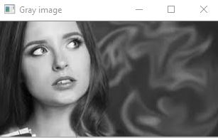

# Histogram and Histogram Equalization of an image
## Aim
To obtain a histogram for finding the frequency of pixels in an Image with pixel values ranging from 0 to 255. Also write the code using OpenCV to perform histogram equalization.

## Software Required:
Anaconda - Python 3.7

## Algorithm:
### Step1:
Import all the necessary libraries.
### Step2:
Read the images using imread() function.
### Step3:
Using calcHist() we can find the histogram of the images.
### Step4:
Using equalizeHist() we can equalize the image.
### Step5:
Using matplotlib.pyplot plot the histogram.
## Program:
```python
# Developed By    : Venkatesh E
# Register Number : 212221230119

import cv2
import matplotlib.pyplot as plt

# Write your code to find the histogram of gray scale image and color image channels.

gray_image = cv2.imread("06-1.jpg")
plt.imshow(gray_image)
plt.show()
hist=cv2.calcHist([gray_image],[0],None,[256],[0,256])
plt.figure()
plt.title("Histogram")
plt.xlabel('Grayscale value')
plt.ylabel('Pixel Count')
plt.stem(hist)
plt.show()

# Display the histogram of gray scale image and any one channel histogram from color image

color_image=cv2.imread("06-2.jpg")
plt.imshow(color_image)
plt.show()
hist1=cv2.calcHist([color_image],[1],None,[256],[0,256])
plt.figure()
plt.title("Histogram")
plt.xlabel("Intensity Value")
plt.ylabel("Pixel Count")
plt.stem(hist1)
plt.show()

# Write the code to perform histogram equalization of the image.

gray_image = cv2.imread('06-1.jpg',0)
equ=cv2.equalizeHist(gray_image)
cv2.imshow('Gray image',gray_image)
cv2.imshow('Equalized Image',equ)
cv2.waitKey(0)
cv2.destroyAllWindows()
```
## Output:
### Input Grayscale Image and Color Image


### Histogram of Grayscale Image and any channel of Color Image


### Histogram Equalization of Grayscale Image


## Result: 
Thus the histogram for finding the frequency of pixels in an image with pixel values ranging from 0 to 255 is obtained. Also,histogram equalization is done for the gray scale image using OpenCV.
